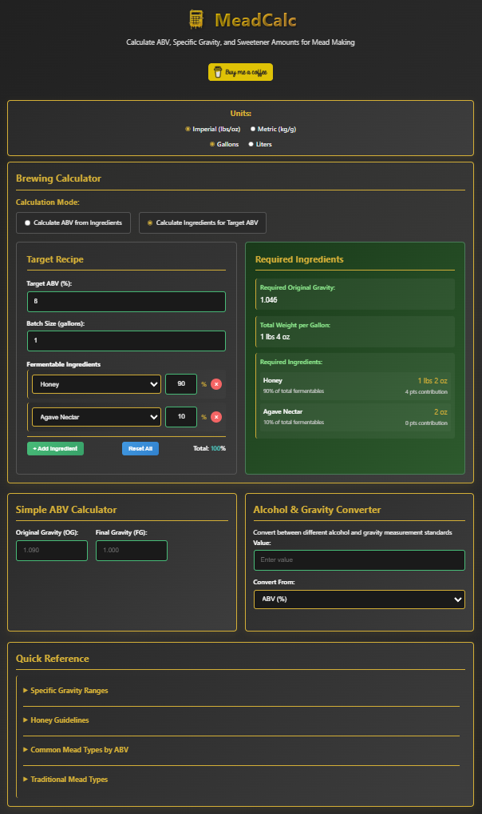

# 🍯 MeadCalc

MeadCalc is a comprehensive, browser-based **mead brewing calculator** with smart unit conversion. It helps brewers calculate sugar additions for desired alcohol content, batch size, and sweetness level with support for both imperial and metric measurements.

**🌐 [Try MeadCalc](https://meadcalc.com/)**



## 🆕 Recent Updates

### 🎉 Latest Enhancements (Latest Release)
- 📱 **Fixed Mobile Portrait Layout**: Resolved calculator layout issues on mobile devices in portrait orientation
- 🎯 **Universal Input Selection**: All input fields now auto-select text on click/tap for effortless data entry
- 🔄 **Improved Calculator Switching**: Seamless mode transitions between "Calculate ABV from Ingredients" and "Calculate Ingredients for Target ABV"
- ⚡ **Enhanced Mobile UX**: Optimized touch interactions and responsive design across all screen sizes
- ☁️ **Cloudflare Pages Integration**: Now deployed on https://meadcalc.com/ with lightning-fast global performance

---

## ✨ Features

### 🧮 **Calculation Tools**
- 📊 **Specific Gravity Calculator**: Calculate OG/FG from honey and fruit additions with batch size support
- 🎯 **Target ABV Calculator**: Design recipes to achieve desired alcohol percentage with ingredient recommendations  
- 📈 **ABV Calculator**: Simple OG/FG to ABV conversion with real-time calculations
- 🔄 **Alcohol & Gravity Converter**: Professional conversion between ABV, ABW, SG, BRIX, and Baumé using industry-standard formulas

### 🌍 **Smart Unit System**
- ⚖️ **Imperial Support**: Pounds, ounces, and gallons with intelligent lbs/oz display (e.g., "1 lbs 7 oz")
- 🌐 **Metric Support**: Kilograms, grams, and liters with smart display (e.g., "120 g" vs "1.25 kg")
- 🔄 **Live Conversion**: Real-time switching between measurement systems
- 📱 **Universal Input Selection**: Click/tap any input field to auto-select all text for quick value replacement

### 🍯 **Ingredient Database**
- 🐝 **Honey Calculations**: 80% fermentable sugar content with temperature-corrected conversions
- 🍎 **25+ Fruits & Sweeteners**: Apple, berry, citrus, and specialty sugar sources
- 📊 **Sugar Content Profiles**: Accurate fermentable sugar percentages for each ingredient
- 🔢 **Multiple Additions**: Support for complex recipes with multiple ingredient types

### 🔧 **Deployment & Management**
- ☁️ **Cloudflare Pages**: Lightning-fast global CDN deployment with automatic updates
- 🐳 **LXC Containerization**: Complete Proxmox deployment with Ubuntu 22.04
- 🌐 **nginx Web Server**: Optimized configuration with security headers and gzip compression
- 📱 **CLI Management Tools**: Built-in `meadcalc` command for updates, status, logs, and backups
- 🔄 **Automated Updates**: Safe updates with backup management and rollback capabilities

### 🎨 **Interface & Usability**  
- 📱 **Mobile-First Responsive Design**: Seamless experience across all devices with optimized mobile portrait layout
- ⚡ **Real-Time Calculations**: Live updates as you type with input validation
- 🎯 **Smart Input Fields**: Universal click/tap text selection for effortless data entry
- 📋 **Reference Materials**: Built-in mead style guidelines and brewing recommendations

This repository contains:
- **HTML/CSS/JS** front-end for the MeadCalc web application
- **meadcalc.sh** script for automated LXC container deployment on Proxmox
- **update-meadcalc.sh** comprehensive update system with backup management
- **MeadCalc CLI tool** for easy container management

---

## 🚀 Quick Deploy on Proxmox (Recommended)

Deploy MeadCalc directly to your Proxmox server with a single command:

```bash
bash -c "$(curl -fsSL https://raw.githubusercontent.com/jacksoneyton/MeadCalc/master/meadcalc.sh)"
```

The deployment script will:
- ✅ Create and configure an Ubuntu 22.04 LXC container
- ✅ Install and configure nginx web server
- ✅ Download and install MeadCalc application files
- ✅ Set up automatic SSL headers and gzip compression
- ✅ Install comprehensive update system and CLI tools
- ✅ Provide you with the container IP and management commands

---

## 🎮 MeadCalc CLI Commands

After deployment, your container includes a powerful CLI tool for easy management:

```bash
# From within the container
meadcalc update    # Update to latest version
meadcalc status    # Show service status and info
meadcalc logs      # View nginx access logs
meadcalc backup    # Create manual backup
meadcalc help      # Show all commands

# From Proxmox host (replace CTID with your container ID)
pct exec CTID -- meadcalc update
```

## 🔄 Update Your Installation

### For containers deployed with the new system:
```bash
meadcalc update
```

### For any MeadCalc container (one-liner):
```bash
curl -fsSL https://raw.githubusercontent.com/jacksoneyton/MeadCalc/master/update-meadcalc.sh | sudo bash
```

Updates include:
- ✅ **Automatic backups** with cleanup (keeps last 5)
- ✅ **Safe verification** of downloads before installation  
- ✅ **Error handling** with rollback instructions
- ✅ **nginx testing** and reload

---

## 📂 Project Structure

```
.
├── calculator.js           # Core calculation logic with smart unit display
├── index.html             # Main MeadCalc interface
├── styles.css             # Responsive styling
├── MeadCalc_logo.png      # Project logo
├── meadcalc.sh            # Proxmox LXC deployment script
├── update-meadcalc.sh     # Comprehensive update system
├── CONTAINER_UPDATE.md    # Update documentation and usage
├── future-features.md     # Planned enhancements
└── test.html              # Test page
```

---

## 🖥 Running MeadCalc Locally (Optional)

If you prefer to run MeadCalc without Proxmox:

1. Download the repository:
   ```bash
   git clone https://github.com/jacksoneyton/MeadCalc.git
   cd MeadCalc
   ```
2. Open `index.html` in your browser.

---

## 🛠 Requirements

### For Proxmox deployment:
- Proxmox VE 7.0+ with LXC support
- SSH or console access to the Proxmox host  
- Internet connectivity for downloading Ubuntu template and MeadCalc files
- Container resources: 1 CPU core, 512MB RAM, 4GB storage (configurable)

### For local development:
- Any modern web browser (Chrome, Firefox, Safari, Edge)
- Local web server (optional, can run directly from filesystem)

---

## 🔧 Technical Details

- **Frontend**: Vanilla JavaScript, HTML5, CSS3 with mobile-first responsive design
- **Deployment**: Cloudflare Pages with GitHub integration for automatic deployments
- **Backend**: nginx web server with optimized configuration (for self-hosting)
- **Container**: Ubuntu 22.04 LXC with security headers and gzip compression
- **Update System**: Bash-based with automatic rollback capabilities
- **Unit System**: Dual imperial/metric with intelligent display formatting
- **UX Features**: Universal input selection, mobile-optimized touch interactions

---

## 🤝 Contributing

1. Fork the repository
2. Create a feature branch (`git checkout -b feature/amazing-feature`)
3. Commit your changes (`git commit -m 'Add amazing feature'`)
4. Push to the branch (`git push origin feature/amazing-feature`)
5. Open a Pull Request

---

## ☕ Support the Project

Enjoying MeadCalc? Consider supporting its development:

[](https://buymeacoffee.com/jacksoneyton)

Your support helps keep MeadCalc free and continuously improved for the brewing community!

---

## 📌 Roadmap

See [`future-features.md`](future-features.md) for planned enhancements and upcoming features.

---

**Author:** [jacksoneyton](https://github.com/jacksoneyton)  
**Repository:** [MeadCalc](https://github.com/jacksoneyton/MeadCalc)  
**Live Site:** [MeadCalc.com](https://meadcalc.com)
